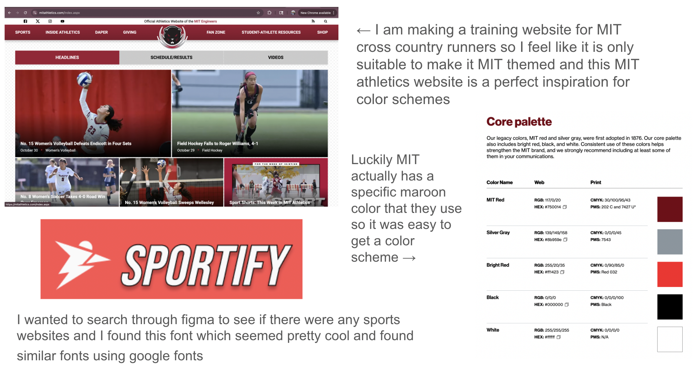

# user journey
There are two main types of users. The coaches and the athletes. In my very final submission I will have the roles robustly implemented with certain persmissions. However, to show the full range of capabilities for the app I have left those out.

When a user first joins the app or wants to sign in they will be prompted to log in with google. Then they must set their user profile information as an athlete or coach and can set certain other profile parameters. Then they can create (if they are a coach) or join a team. 

Then the user may want to look at the team shared calander and create an event. The additionally may also want to send a notification, that sends an email to everyone on the team. 

They can then log their training information, then they can see the trends amongst themselves and the members of the team (this would only be allowed to coaches). 


[video](./Assignment%204b.mov)

## Design




## Development

Start the dev server:

```bash
npm run dev
```

